# Projeto de Interface

O fluxo de navegação do sistema foi projetado para ser simples, intuitivo e eficiente, reduzindo a curva de aprendizado e facilitando o uso por todos os colaboradores da oficina.

### 1. Autenticação

O usuário inicia sua jornada realizando o login no sistema.  
Após a autenticação bem-sucedida, ele é direcionado ao **Dashboard**.

---

### 2. Dashboard

No painel principal, o usuário pode visualizar:

- Ordens de serviço em andamento  
- Serviços finalizados  
- Indicadores operacionais  
- Informações gerais do sistema  

O Dashboard funciona como ponto central de navegação.

---

### 3. Módulos do Sistema

A partir do painel principal, o usuário pode acessar os seguintes módulos:

#### Clientes e Veículos
- Cadastro de clientes  
- Cadastro de veículos  
- Consulta e edição de informações  

#### Ordens de Serviço
- Criação de novas ordens  
- Atualização de status  
- Registro de serviços realizados  

#### Histórico de Manutenção
- Consulta detalhada dos serviços executados  
- Visualização de histórico por veículo   

---

### Objetivo do Fluxo

O fluxo foi estruturado para:

- Garantir facilidade de acesso às informações  
- Reduzir etapas desnecessárias  
- Organizar os módulos de forma lógica  
- Proporcionar rapidez na execução das tarefas diárias  

O sistema busca auxiliar a gestão da oficina de forma prática, organizada e eficiente.

---

## User Flow

### User Flow Perfil Mecânico

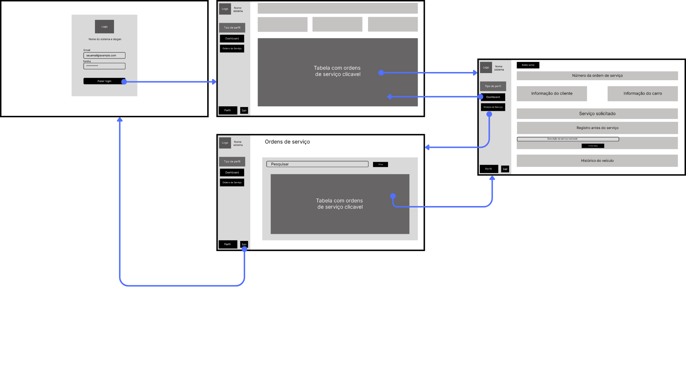

---

### User Flow Perfil Administrativo

---

### User Flow Perfil Proprietário

---

## Wireframes

### Perfil Mecânico

---

### Perfil Administrativo

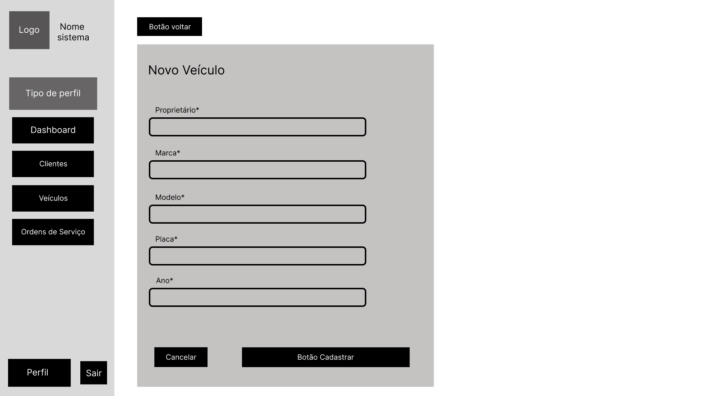

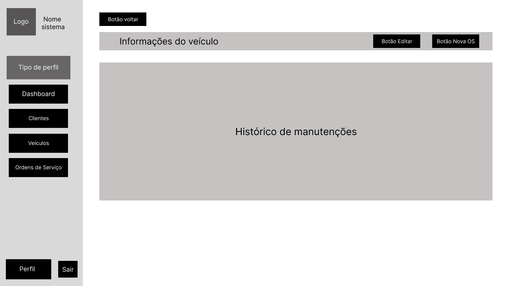

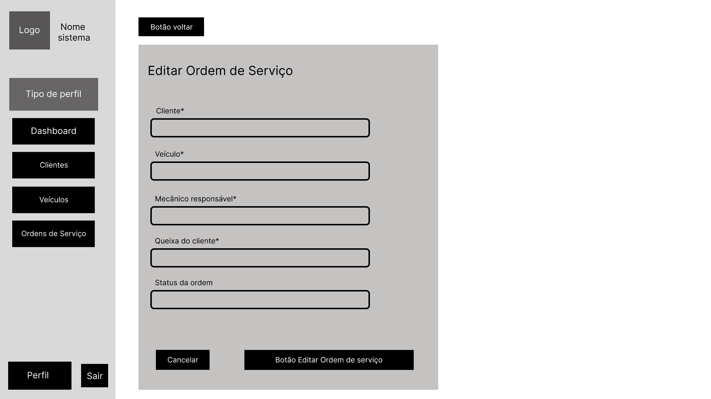

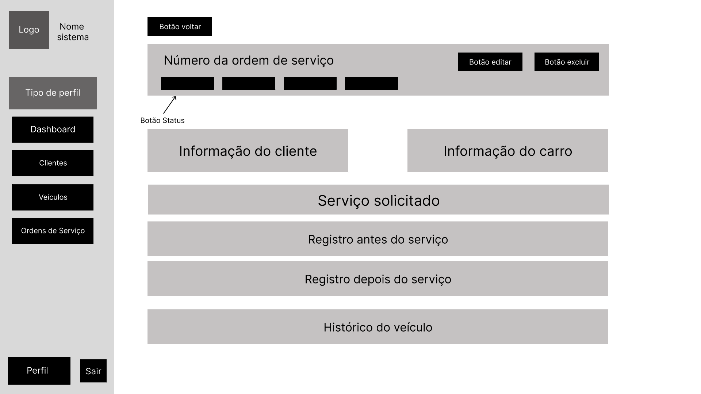

---

## Perfil Proprietário

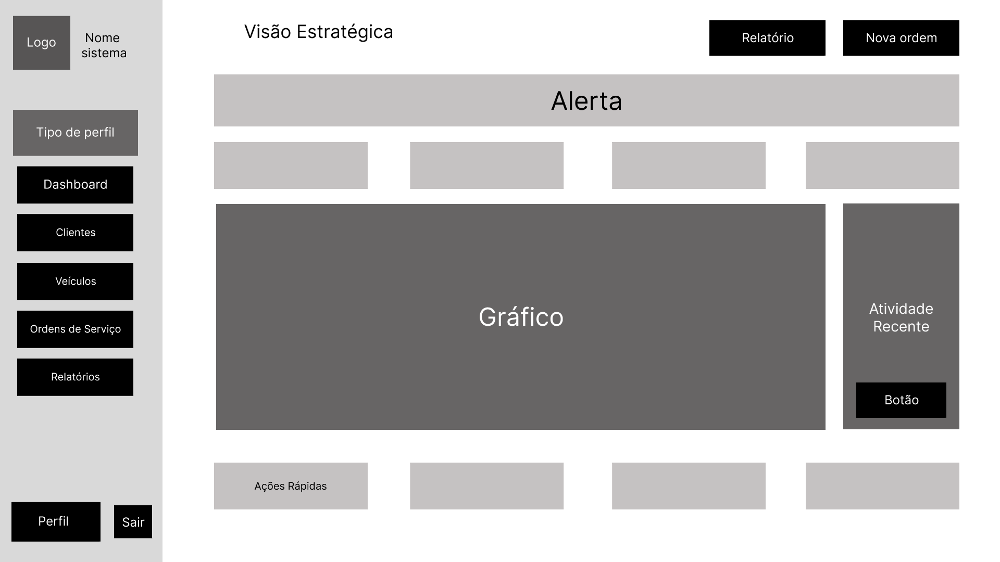

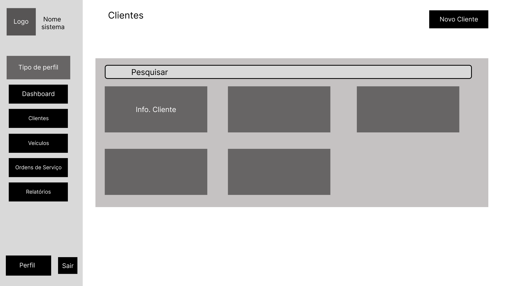

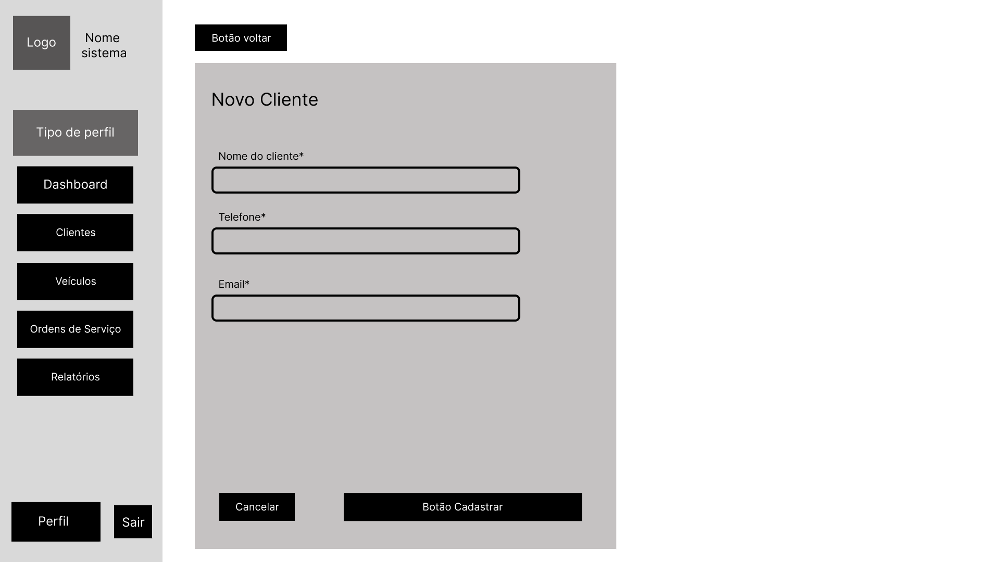

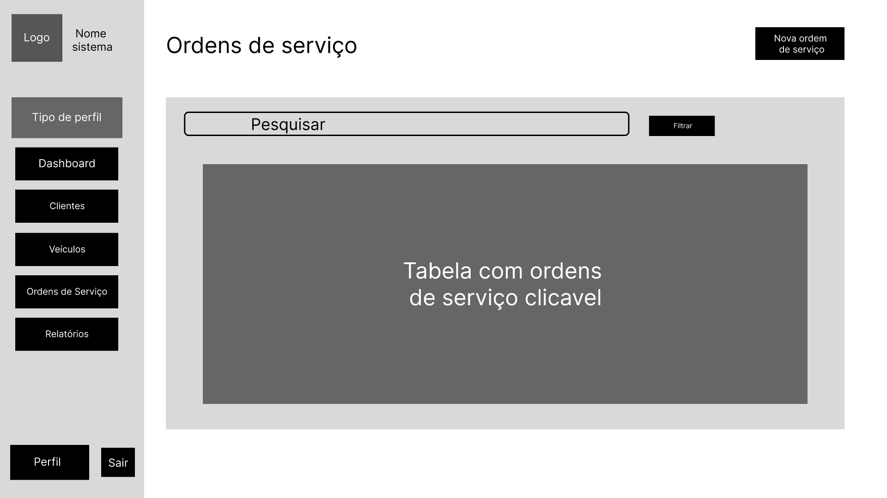

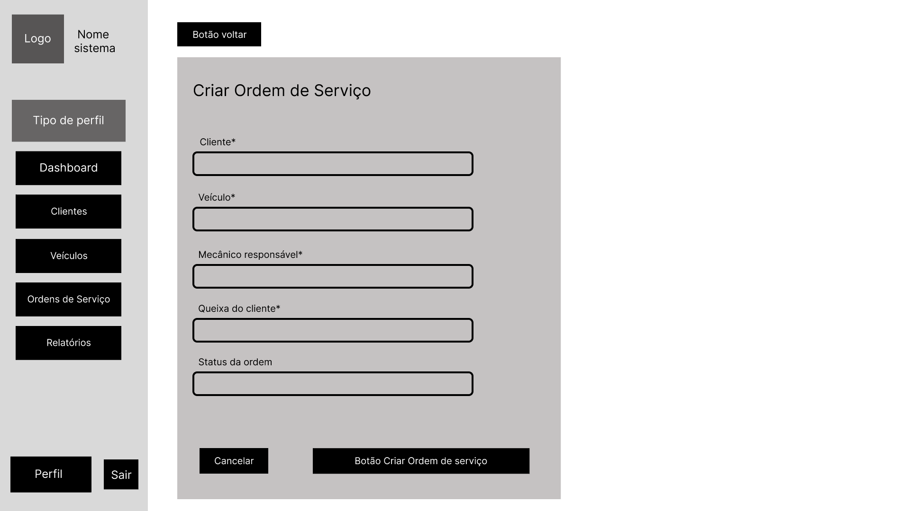

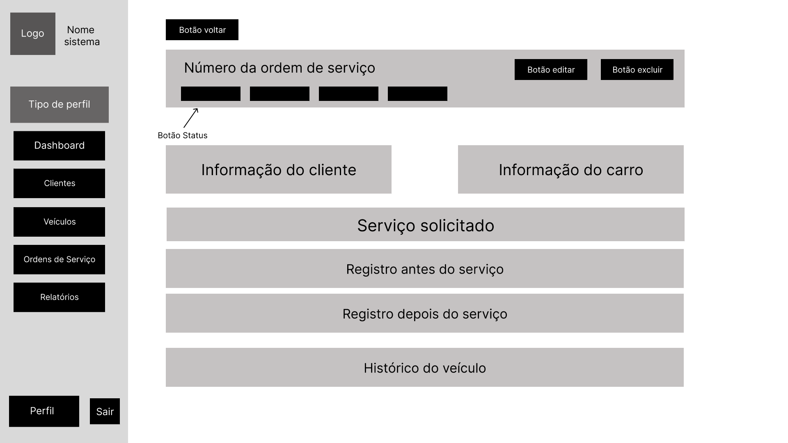

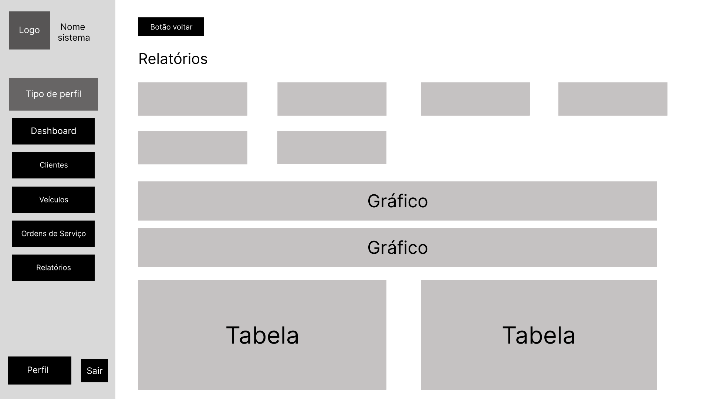
